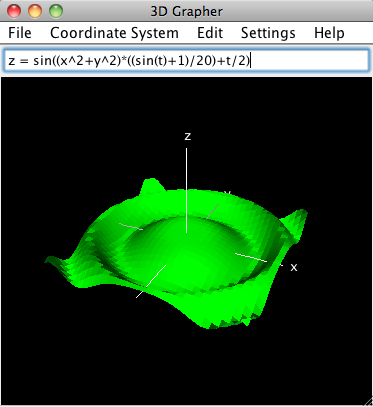

This directory contains:

 * Grapher3D.jar - an executable JAR file containing a desktop 3D graphing calculator application. The program is capable of:
   * Rendering time-varying parametric surfaces
   * Rotating the surfaces with the mouse
   * Changing parameters such as grid resolution and color
   * Popping up sliders for interactively manipulating variables used in the surface equations
 * CurranPhysics - a 2D and 3D simulation of charged particles in a viscous fluid. Sliders are provided to manipulate simulation parameters such as charge intensity, viscosity, attraction, repulsion, and gravity.
 * CodeBase.zip - The Java source code common to both applications. It contains an implementation of:
   * A math expression parser
   * A 3D engine that renders using the Java2D API
   * A framework for linking UI elements to variables in expressions

Here's a screenshot of the 3D graphing calculator:

</img>

You can try the program yourself by downloading and running the [Grapher3D.jar](https://github.com/curran/portfolio/blob/gh-pages/2007/3D%20Graphing%20Calculator/Grapher3D.jar?raw=true) file.
