Founder @ [Datavis Tech Inc](http://www.datavis.tech/).

I'm available for hire as a freelancer / consultant! Feel free to reach out at curran.kelleher@gmail.com .

 * [Resume](http://curran.github.com/portfolio/Resume.pdf)
 * [LinkedIn](http://www.linkedin.com/profile/view?id=27871853)
 * [Ph. D.](https://github.com/curran/phd)
 * [Twitter](https://twitter.com/currankelleher)
 * [GitHub](https://github.com/curran?tab=repositories)
   * [ModelJS](https://github.com/curran/model)
   * [Chiasm](https://github.com/curran/chiasm)
   * [Screencasts](https://github.com/curran/screencasts)
   * [bl.ocks](http://bl.ocks.org/curran)
 * [Video Lectures on YouTube](https://www.youtube.com/user/currankelleher/videos)
 * [University Transcript](http://curran.github.com/portfolio/UMass Lowell Transcript.pdf)
 * [Photos on Flickr](https://www.flickr.com/photos/10604632@N02/sets/)
 * [Music on SoundCloud](https://soundcloud.com/curran)

## 2017 Work

 * [d3-component](https://github.com/curran/d3-component) A lightweight component abstraction for D3.js.
 * [Campaign Finance Institute data exploration and download tool](https://github.com/cfinst/cfinst.github.io/) An interactive visualization of the Campaign Finance Institute database of campaign finance law, spanning all US States and every other year since 1996.
 * [josquin-ribbon](https://github.com/sul-cidr/josquin-ribbon) A consulting project done for a music research group at Stanford University.

## 2016 Work

* [Introduction to Data Visualization (YouTube Video)](https://www.youtube.com/watch?v=itNlukt5x18)
* The Reactive Model Stack (Open Source Projects)
  * [ReactiveModel](https://github.com/curran/reactive-model)
  * [ReactiveFunction](https://github.com/curran/reactive-function)
  * [GraphDataStructure](https://github.com/curran/graph-data-structure)
  * [ReactiveProperty](https://github.com/curran/reactive-property)

## 2015 Work
 * [Splitting Charts Tutorial Series](https://github.com/curran/screencasts/tree/gh-pages/splittingCharts)
   * [Splitting Charts (Part 1): Stacked & Grouped Bar Charts](https://www.youtube.com/watch?v=6Xynj_pBybc)
   * [Splitting Charts (Part 2) Getting Circular](https://www.youtube.com/watch?v=dZgLxh_Z86A)
   * [Splitting Charts (Part 3) - Pie Charts & Friends](https://www.youtube.com/watch?v=QCiA4fD8-Hs)
   * [Splitting Charts (Part 4) - Small Multiples Pies](https://www.youtube.com/watch?v=XN2hfpGqX4o)
   * [Splitting Charts (Part 5) - Multi-Line Charts](https://www.youtube.com/watch?v=GzH7qUVIkE8)
   * [Splitting Charts (Part 6) - Stacked Area Charts](https://www.youtube.com/watch?v=5H7PSAqZ0Co)
 * <a href="https://www.youtube.com/watch?v=U4ja6HeBm6s">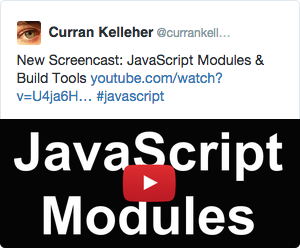</a>[Screencast: JavaScript Modules & Build Tools](https://www.youtube.com/watch?v=U4ja6HeBm6s) - A brief tour of the ocean of tools around JavaScript Modules. Covers Browser Globals, Namespaces, UglifyJS, CommonJS, AMD, ES6, Browserify, Webpack, RequireJS, JSPM, Esperanto, Rollup, Gulp, Babel, Traceur, and Make.
 * [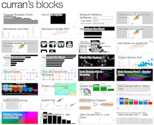](http://bl.ocks.org/curran) [Visualization examples on bl.ocks.org](http://bl.ocks.org/curran)
 * <a href="https://www.youtube.com/watch?v=8jvoTV54nXw">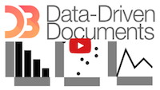</a>[Screencast: Introduction to D3.js](https://www.youtube.com/watch?v=xN9QxPtK2LM) - This screencast covers how to create data visualizations with D3.js.
 * [Published Academic Paper: Reactive Data Visualizations](2015/reactiveVisualizationsPaper.pdf) A paper about using functional reactive programming for interactive data visualization, published at SPIE Visualization and Data Analysis 2015, February 2015, San Francisco, CA.
 * [Chiasm](https://github.com/curran/chiasm) An Open Source plugin architecture for information visualization.
 * [ModelJS](https://github.com/curran/model) A functional reactive programming library for interactive data visualizations.
 * <a href="https://github.com/curran/crossCountry">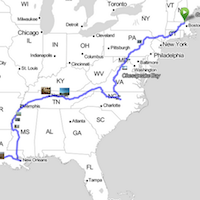</a>[Cross Country Trip Map](https://github.com/curran/crossCountry) - A geographically oriented photo show of my cross country trip. Built using Leaflet.
 * <a href="https://www.youtube.com/watch?v=GxGkHam33Cw">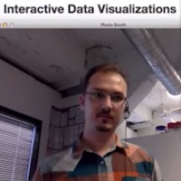</a>[Constructing Interactive Data Visualizations](https://www.youtube.com/watch?v=GxGkHam33Cw) - A YouTube talk on my planned data visualization work - [Chiasm](https://github.com/curran/chiasm).

## 2014 Work

 * <a href="https://www.youtube.com/watch?v=XVHyygdD1Kg&feature=youtu.be&a">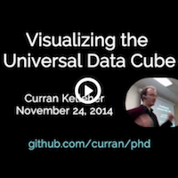</a>[Visualizing the Universal Data Cube](https://www.youtube.com/watch?v=XVHyygdD1Kg&feature=youtu.be&a) - Doctoral dissertation
 * <a href="https://github.com/curran/model">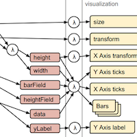</a>[model.js](https://github.com/curran/model) - A functional reactive model library for building dynamic data visualizations.
 * <a href="https://www.youtube.com/watch?v=xN9QxPtK2LM">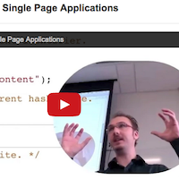</a>[Navigation for Single Page Applications](https://www.youtube.com/watch?v=xN9QxPtK2LM) - This screencast covers how to construct a single page application with a tab-like navigation user interface and routing.
 * <a href="https://github.com/curran/screencasts/tree/gh-pages/reactiveDataVis">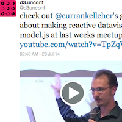</a>[Reactive Data Visualization](https://github.com/curran/screencasts/tree/gh-pages/reactiveDataVis) - A presentation on reactive model driven data visualization, given at the [Bay Area d3 User Group Meetup](http://www.meetup.com/Bay-Area-d3-User-Group/events/192685742/).
 * <a href="https://github.com/curran/phd">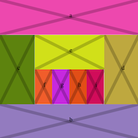</a>[Visualizing the Universal Data Cube](https://github.com/curran/phd) - My doctoral dissertation about integrating and visualization heterogeneous data cubes using HTML5.
 * Introduction to Angular.js in 50 examples (part 1) - [screencast](https://www.youtube.com/watch?v=TRrL5j3MIvo&feature=youtu.be) - [code](https://github.com/curran/screencasts/tree/gh-pages/introToAngular) - A lecture that first covers background of data binding, single-page-apps and related libraries, then introduces Angular features by example.

## 2013 Work

 * <a href="http://curran.github.io/webVisSTAR/">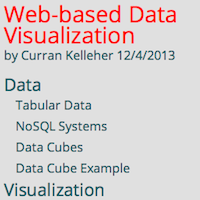</img></a>[Web-based Data Visualization](http://curran.github.io/webVisSTAR/) (December 2013) - A presentation that surveys the state of the art in Web-based Data Visualization and related technologies.
 * <a href="https://github.com/curran/screencasts/tree/gh-pages/grapher">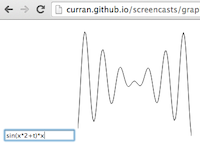</img></a>[Building a Graphing Calculator with HTML5](https://github.com/curran/screencasts/tree/gh-pages/grapher) (November 2013) - A screencast tutorial in which students learn how to program a graphing calculator in HTML5 from scratch.
 * <a href="https://github.com/curran/notes">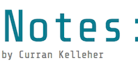</img></a>[Notes](https://github.com/curran/notes) (November 2013) - A Backbone.js powered serverless blog engine, used for publishing miscellaneous notes.
 * <a href="http://curran.github.io/vis2013Tutorial/">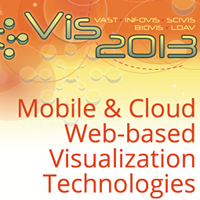</img></a>[Tutorial on Web Graphics and Visualization Technologies](http://curran.github.io/vis2013Tutorial/) (October 2013) - The material presented at the IEEE Vis 2013 conference in a tutorial called "Mobile and cloud Web-based graphics and visualization".
 * <a href="https://github.com/curran/portfolio/blob/gh-pages/2013/UserInsightIngressDashboard.pdf?raw=true">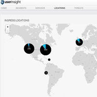</img></a>[Rapid7 User Insight Ingress Dashboard](http://curran.github.io/portfolio/2013/UserInsightIngressDashboard.pdf) (June - August 2013) - Designed and implemented an interactive visualization dashboard with multiple linked views for exploring and presenting corporate login data. This work is in production in Rapid7's UserInsight cybersecurity data analysis product (it's the map with pie charts, timeline and bar chart). See also the [UserInsight Data Sheet](http://curran.github.io/portfolio/2013/UserInsight-DataSheet.pdf), which features a screenshot of the map.
 * </img>[Screencast on Mathematical Graphical Patterns](https://github.com/curran/screencasts/tree/gh-pages/mathPatterns) (July 2013) - A screencast from a tutorial given at MIT on July 28, 2013. Part of the HSSP 2013 course Computer Programming and Interactive Graphics. In this tutorial we explore variations on mathematical animations of a grid of circles.
 * </img>[dashboardScaffold](https://github.com/curran/dashboardScaffold) (July 2013) - An open source visualization dashboard layout and dynamic configuration framework. Developed while interning at Rapid7 creating cybersecurity visualization visualization dashboards with multiple linked views.
 * [Introduction to Computer Programming](http://www.youtube.com/watch?v=zIpA8k167gU) (July 2013) - A screencast from a tutorial given at MIT on July 21, 2013. Part of the HSSP 2013 course Computer Programming and Interactive Graphics. Covers JavaScript language features and basic graphics.
 * [Grammar of Graphics in HTML5](https://docs.google.com/document/d/1shaxGjI3a-IbaAKCTE4BIOYEdoHO-ec06T7oKs5ozHs/edit) ([pdf](http://curran.github.io/portfolio/2013/GrammarofGraphicsinHTML5.pdf))
 * 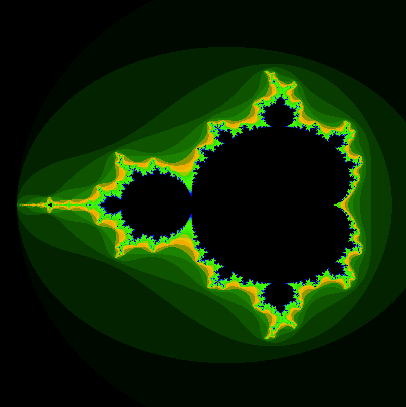</img>[Mandelbrot](https://github.com/curran/mandelbrot) A Mandelbrot Set renderer that runs on the GPU using WebGL shaders.
 * [Lambda](https://github.com/curran/lambda) A Lambda Calculus interpreter in Haskell and CoffeeScript.
 * 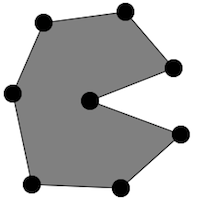</img>[HTML5 Polygon Editor](https://github.com/curran/screencasts/tree/gh-pages/polygonEditor) (April 2013) - A [screencast](http://www.youtube.com/watch?v=lNfKn0wbxYI&feature=youtu.be) on building a Polygon Editor using Backbone, Require.js, and Canvas.
 * 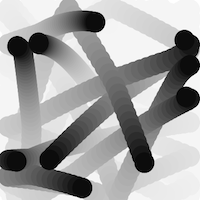</img>[HTML5 Bouncing Circles](https://github.com/curran/screencasts/tree/gh-pages/bouncingCircles) (March 2013) - A [screencast](http://www.youtube.com/watch?v=yF0T7lviBnY&feature=youtu.be) in which a simulation of bouncing and colliding balls is programmed from scratch using JavaScript and HTML5 Canvas.
 * [Introduction to JavaScript and HTML5 Canvas](http://www.youtube.com/watch?v=vEOwgWpm3XQ) (February 2013) - A screencast introducing JavaScript and HTML5 Canvas, from a tutorial given at UMass Lowell sponsored by the ACM and UML Computer Science Graduate Student Organization.

## 2012 Work

 * 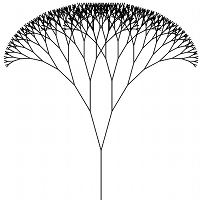</img>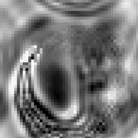</img>[Introduction to Computer Programming and Interactive Graphics](http://curransoft.com/interactivegraphics/?p=1) - The blog used throughout a course I taught at MIT on HTML5 graphics to high school students as part of MIT's summer [Junction](http://esp.mit.edu/learn/Junction/index.html) program.
   * HTML5 Graphics Examples from the course: [run them](http://curran.github.com/HTML5Examples/), [source code](http://github.com/curran/HTML5Examples)
 * [Cloud and Mobile Web Graphics and Visualization](http://curran.github.com/portfolio/2012/Cloud and Mobile Web Graphics and Visualization.pdf) - An encyclopedia entry on Web graphics technology.
 * 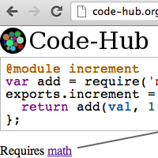</img>[CodeHub](http://curran.github.com/portfolio/2012/CodeHub.pdf) - Slides from a presentation on a Web-based IDE project.
 * [Quadstream Project Report](http://curran.github.com/portfolio/2012/Quadstream Project Report.pdf) - A report from a class project on multi-scale polygon generalization for Web-based choropleth maps.
 * [A Web-based Data Cube Visualization Ecosystem Architecture](http://curran.github.com/portfolio/2012/A Web-based Data Cube Visualization Ecosystem Architecture.pdf) - A summary of my doctoral dissertation, presented at the IEEE VisWeek 2012 Doctoral Colloquium.
 * 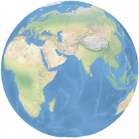</img>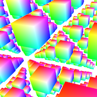</img>[WebGL Examples](https://github.com/UMLComputerGraphics/GraphicsProject/tree/master/WebGLExamples) - Educational examples produced while I was a Teaching Assistant for the course "Computer Graphics with OpenGL ES".

## 2011 Work

 * 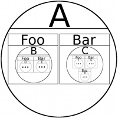</img>[Fractal Perspective](http://curran.github.com/portfolio/2011/Fractal Perspective.pdf) - A concept paper on visualizing [RDF](http://en.wikipedia.org/wiki/Resource_Description_Framework), presented at the Fifteenth International Conference on Information Visualisation (IV'11) in London.
 * 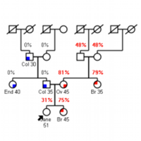</img>[Assessing Risks for Families with Inherited Cancers](http://curran.github.com/portfolio/2011/Assessing Risks for Families with Inherited Cancers.pdf) - A paper on the breast cancer risk assessment platform I worked on at Masachusetts General Hospital. Presented at IEEE VisWeek 2011: Workshop on Visual Analytics in Healthcare.

## 2010 Work

 * 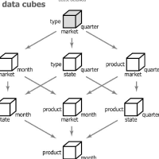[Multiscale Visualization using Data Cubes](http://curran.github.com/portfolio/2010/Multiscale Visualization using Data Cubes.pdf) - Slides from a presentation on the paper [Multiscale Visualization Using Data Cubes](http://graphics.stanford.edu/papers/pan_zoom/paper.pdf)
 * 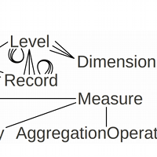</img>[Universal Data Cube](http://curran.github.com/portfolio/2010/Universal Data Cube.pdf) - A report on my work on developing the "Universal Data Cube" concept at University of Konstanz.
 * 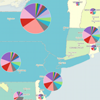</img>[Visualizing Bureau of Labor Statistics Employment Data](http://curran.github.com/portfolio/2010/Visualizing Bureau of Labor Statistics Employment Data.pdf) - Slides on a class project where Employment data was explred visually using Tableau.

## 2009 Work

 * 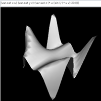</img>[3D Graphing Calculator in Clojure](http://curransoft.com/code/2009/05/3d-grapher-in-clojure/) - A class project where Clojure and OpenGL were used to build a 3D surface plotter with mouse rotation controls.

## 2008 Work

 * 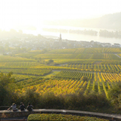</img>[Life of a Human - A Year in Germany](http://curran.github.com/portfolio/2008/Life of a Human - A Year in Germany.pdf) - The book I compiled from my blog posts during my year abroad in Germany.

## 2007 Work
 * 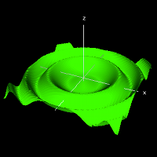</img> [3D Graphing Calculator and Physics Simulation](https://github.com/curran/portfolio/tree/gh-pages/2007/3D%20Graphing%20Calculator)
 * 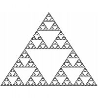</img> [RecursiveStructuresAndProcesses](http://curran.github.com/portfolio/2007/RecursiveStructuresAndProcesses.pdf) - The material I covered when I co-taught an 8-week course with MIT student Justin Curry, entitled "Gödel, Escher, Bach: A Mental Space Odyssey". [Lecture videos available on MIT's OpenCourseWare](http://ocw.mit.edu/high-school/courses/godel-escher-bach/).
 * 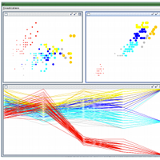</img> [JyVis](http://curran.github.com/portfolio/2007/JyVis.pdf) - A paper on a Java-based interactive information visualization system I built at a summer project. Published as a technical report by UMass Lowell.

## 2006 Work

 * 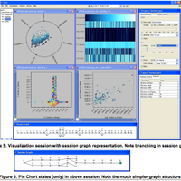</img> [Collecting and Harnessing Rich Session Histories](http://curran.github.com/portfolio/2006/Collecting and Harnessing Rich Session Histories.pdf) and [Metrics for Analyzing Rich Session Histories](http://curran.github.com/portfolio/2006/Metrics for Analyzing Rich Session Histories.pdf) - Papers from work done at the [IVPR](http://www.uml.edu/Research/IVPR/about.aspx) on the session history replay and analysis features of the [Universal Visualization Platform](http://www.cs.uml.edu/~agee/publications/spie2005/spie2005.pdf).

 * 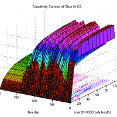</img> [Information Theoretic and Complexity Considerations in Four Classes of Cellular Automata](http://curran.github.com/portfolio/2006/Information Theoretic and Complexity Considerations in Four Classes of Cellular Automata.pdf) - A report from a project done at an intensive week-long course in Dynamics of Complex Systems taught by [Yaneer Bar-Yam](http://necsi.edu/faculty/bar-yam.html) at MIT.
